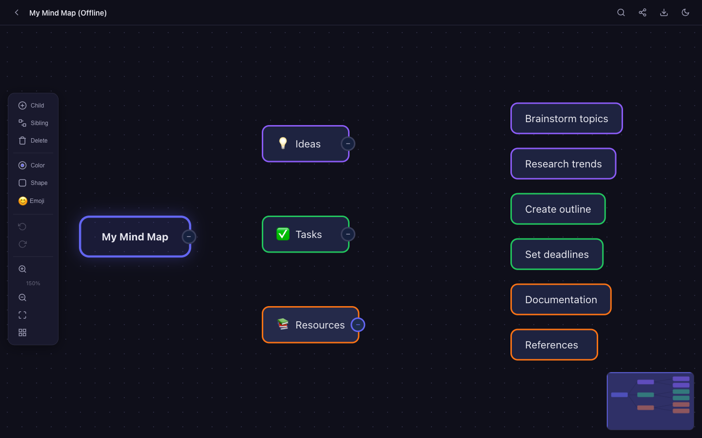

<div align="center">

# MindFlow

[](https://developer.mozilla.org/en-US/docs/Web/HTML)
[](https://developer.mozilla.org/en-US/docs/Web/CSS)
[](https://developer.mozilla.org/en-US/docs/Web/JavaScript)
[](https://firebase.google.com/)
[](LICENSE)

**A modern, real-time collaborative mind mapping web app for teams, classrooms, and workshops.**

[Live Demo](https://alfredang.github.io/mindmapping/) · [Report Bug](https://github.com/alfredang/mindmapping/issues) · [Request Feature](https://github.com/alfredang/mindmapping/issues)

</div>

## Screenshot



## About

MindFlow is a sleek, feature-rich mind mapping application built with pure HTML, CSS, and JavaScript — no frameworks required. It enables real-time collaborative brainstorming through Firebase-powered room sessions, complete with QR code sharing for instant mobile joining.

### Key Features

| Feature | Description |
|---------|-------------|
| **Collaborative Editing** | Real-time multi-user editing with Firebase sync and user presence indicators |
| **QR Code Sharing** | Generate and scan QR codes to instantly join mind map sessions |
| **Drag & Drop** | Freely reposition nodes with smooth drag-and-drop interactions |
| **Dark / Light Theme** | Toggle between polished dark and light themes (dark default) |
| **Keyboard Shortcuts** | Enter (add child), Tab (add sibling), Delete (remove), Ctrl+Z/Y (undo/redo), Ctrl+F (search) |
| **Node Styling** | Custom colors, shapes (rounded, pill, rectangle, diamond), and emoji support |
| **Collapse / Expand** | Collapse branches with descendant count badges |
| **Search & Filter** | Find nodes instantly with highlighted results and dimmed non-matches |
| **Export** | Export mind maps as PNG images or JSON files; import previously saved JSON |
| **Minimap** | Overview minimap for quick navigation in large mind maps |
| **Auto Layout** | Automatic tree layout with manual repositioning override |
| **Undo / Redo** | Full undo/redo history with state snapshots |
| **Auto Save** | Automatic localStorage persistence with debounced saving |
| **Responsive** | Works on desktop, tablet, and mobile with touch-friendly controls |

## Tech Stack

| Category | Technology |
|----------|-----------|
| **Frontend** | HTML5, CSS3, Vanilla JavaScript (ES6+) |
| **Real-time Sync** | Firebase Realtime Database |
| **QR Generation** | QRCode.js |
| **Image Export** | html2canvas |
| **Rendering** | Hybrid DOM (nodes) + SVG (bezier connections) |
| **Deployment** | GitHub Pages |

## Architecture

```
┌─────────────────────────────────────────────────┐
│                   Browser UI                     │
│  ┌──────────┐  ┌──────────┐  ┌───────────────┐  │
│  │ Landing   │  │ Canvas   │  │   Toolbar     │  │
│  │ Screen    │  │ Viewport │  │   + Minimap   │  │
│  └──────────┘  └──────────┘  └───────────────┘  │
├─────────────────────────────────────────────────┤
│                Application Layer                 │
│  ┌─────────┐ ┌──────────┐ ┌─────────┐          │
│  │ MindMap  │ │ Renderer │ │   UI    │          │
│  │ (Data)   │ │ (DOM+SVG)│ │ (Events)│          │
│  └────┬─────┘ └──────────┘ └─────────┘          │
│       │     ┌──────────┐  ┌──────────┐          │
│       ├────►│ History  │  │  Export  │           │
│       │     │ (Undo)   │  │ (PNG/JSON│           │
│       │     └──────────┘  └──────────┘          │
├───────┼─────────────────────────────────────────┤
│       │        Collaboration Layer               │
│       ▼                                          │
│  ┌──────────────────────────────────────┐        │
│  │     Firebase Realtime Database       │        │
│  │  /rooms/{id}/nodes  /presence        │        │
│  └──────────────────────────────────────┘        │
└─────────────────────────────────────────────────┘
```

## Project Structure

```
mindmapping/
├── index.html              # Single-page app (landing + workspace)
├── style.css               # Themes, layout, animations, responsive
├── screenshot.png          # App screenshot
├── screenshots/            # Additional screenshots
│   ├── landing.png
│   └── workspace-dark.png
├── js/
│   ├── utils.js            # ID generation, EventBus, debounce, helpers
│   ├── mindmap.js          # Data model, tree CRUD, auto-layout
│   ├── renderer.js         # DOM nodes, SVG connections, drag/drop, pan/zoom
│   ├── history.js          # Undo/redo state snapshots
│   ├── collaboration.js    # Firebase sync, rooms, presence
│   ├── ui.js               # Toolbar, shortcuts, search, minimap, themes
│   ├── export.js           # PNG and JSON export/import
│   └── app.js              # Entry point, routing, module wiring
└── README.md
```

## Getting Started

### Prerequisites

- A modern web browser (Chrome, Firefox, Safari, Edge)
- (Optional) Firebase project for real-time collaboration

### Installation

1. **Clone the repository**
   ```bash
   git clone https://github.com/alfredang/mindmapping.git
   cd mindmapping
   ```

2. **Open locally**
   ```bash
   # Simply open index.html in your browser, or use a local server:
   python3 -m http.server 8080
   # Then visit http://localhost:8080
   ```

3. **(Optional) Configure Firebase for collaboration**

   Edit `js/collaboration.js` and replace the placeholder config (lines 19-27) with your Firebase project credentials:

   ```javascript
   const FIREBASE_CONFIG = {
     apiKey: "your-api-key",
     authDomain: "your-project.firebaseapp.com",
     databaseURL: "https://your-project-default-rtdb.firebaseio.com",
     projectId: "your-project",
     storageBucket: "your-project.appspot.com",
     messagingSenderId: "your-sender-id",
     appId: "your-app-id",
   };
   ```

   Set your Firebase Realtime Database rules for development:
   ```json
   { "rules": { ".read": true, ".write": true } }
   ```

### Usage

1. Open the app and click **Create Session** or **Work Offline**
2. Add nodes using the toolbar or keyboard shortcuts
3. Drag nodes to reposition, double-click to edit text
4. Share via room code or QR code for real-time collaboration
5. Export your mind map as PNG or JSON when done

### Keyboard Shortcuts

| Shortcut | Action |
|----------|--------|
| `Enter` | Add child node |
| `Tab` | Add sibling node |
| `Delete` / `Backspace` | Delete selected node |
| `Ctrl + Z` | Undo |
| `Ctrl + Y` | Redo |
| `Ctrl + F` | Search nodes |
| `F2` | Edit selected node |
| `Escape` | Deselect / close |
| `Ctrl + +/-` | Zoom in/out |
| `Ctrl + 0` | Fit view |

## Deployment

### GitHub Pages

The app is a static site and can be deployed directly to GitHub Pages:

1. Go to your repository **Settings** > **Pages**
2. Set source to **GitHub Actions**
3. The included workflow will automatically deploy on push to `main`

### Any Static Host

Simply upload all files to any static file hosting service — no build step required.

## Contributing

Contributions are welcome! Here's how:

1. **Fork** the repository
2. **Create** a feature branch (`git checkout -b feature/amazing-feature`)
3. **Commit** your changes (`git commit -m 'Add amazing feature'`)
4. **Push** to the branch (`git push origin feature/amazing-feature`)
5. **Open** a Pull Request

For questions and discussions, please [open an issue](https://github.com/alfredang/mindmapping/issues).

---

<div align="center">

### Developed by [Tertiary Infotech Academy Pte Ltd](https://www.tertiarycourses.com.sg/)

**Acknowledgements:** Built with [Firebase](https://firebase.google.com/), [QRCode.js](https://github.com/davidshimjs/qrcodejs), and [html2canvas](https://html2canvas.hertzen.com/).

If you found this useful, please give it a ⭐

</div>
